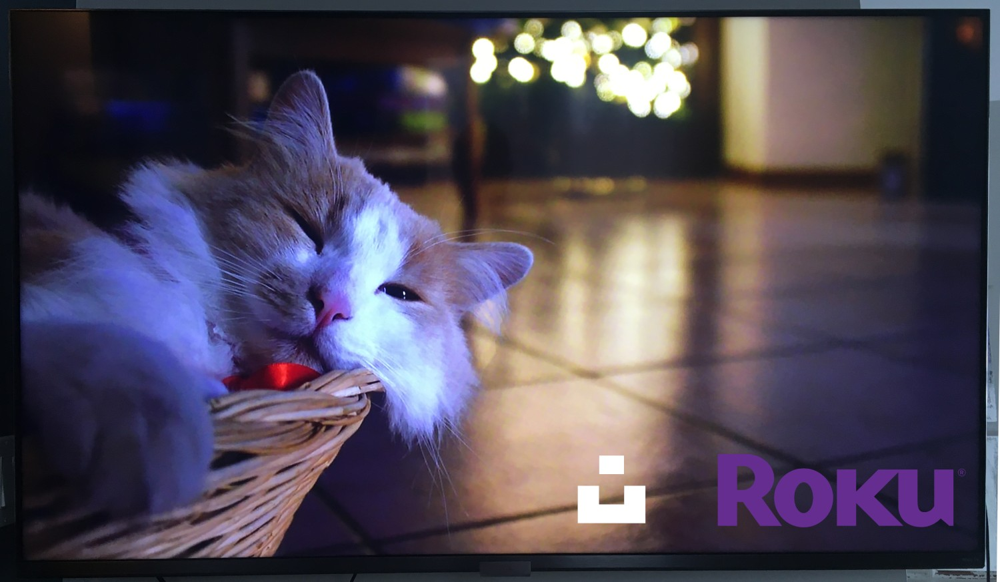

# Roku Unsplash Screensaver

Ad-Free Open Source Roku Screensaver showing random images from Unsplash.



## How to install

1. To enter dev mode, using your Roku remote, enter the following button sequence:

    🏠 🏠 🏠 + 🔼 🔼 + ▶️ ◀️ + ▶️ ◀️ + ▶️

1. Follow instructions on [Roku developer program](https://developer.roku.com/en-ca/docs/developer-program/getting-started/roku-dev-prog.md). Make sure you succeed with their hello world example first.
1. Clone this repository and `cd` into it.
1. Download `app.mk` from roku's example to project's parent folder

    ```bash
    wget https://raw.githubusercontent.com/rokudev/samples/master/getting%20started/makefile/app.mk -O ../app.mk
    ```

    _if you're on MacOS and you get 'ERROR: Device is not responding to ping.', refer to [rokudev/samples#28](https://github.com/rokudev/samples/issues/28)_.

1. Copy and fill environment variables

    ```bash
    cp .env .env.example
    vim .env # or use whatever editor you want here
    ```

1. Load environment variables

    ```bash
    export $(cat .env | xargs)
    ```
    
    Note: The above command is the equivalent of running `export WHATHEVER=something` in your shell for each line in the `.env`, you could also `export` them by hand if you prefer.

1. Deploy to your device

    ```bash
    make install
    ```

:tada:

## Contributing

Contributions are welcome! 🙏

1. Make sure you read [Roku Screensavers documentation](https://developer.roku.com/en-ca/docs/developer-program/media-playback/screensavers.md) if you intend to modify the code.
2. Have a look [to the issues](https://github.com/gableroux/roku-unsplash-screensaver/issues), there's some work and open questions in here.

## Disclaimer

This repository is not sponsored by or affiliated with Roku and Unsplash.

## License

[MIT](LICENSE.md) © [Gabriel Le Breton](https://gableroux.com)

